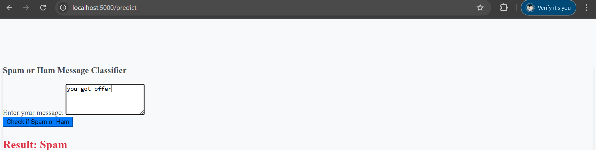

# Spam Message Classifier with Web Interface



## Overview

This project implements a **Spam Message Classifier** using Python, machine learning, and a **Flask** web application. The classifier is designed to classify messages as **spam** or **ham** (non-spam) based on their content. It uses a pre-trained machine learning model (Naive Bayes) to categorize user input and provides instant feedback through a simple web interface.

## Purpose

The purpose of this project is to build an accessible web-based tool that can classify whether a message is spam or ham. This can be useful for various applications, including:

- Automatically filtering unwanted messages.
- Enhancing email management systems.
- Understanding common patterns in spam messages.

## Features

- **Web Interface**: Users can enter a message and receive instant classification (Spam or Ham).
- **Data Preprocessing**: Text data is cleaned and prepared for analysis.
- **Feature Extraction**: Converts text into numerical features using **TF-IDF** (Term Frequency-Inverse Document Frequency).
- **Spam Classification**: The **Naive Bayes** algorithm is used to predict if the message is spam or not.
- **Visualization**: Generates word clouds that visualize the most frequent words in spam messages.
- **Model**: Pre-trained machine learning model using **joblib** to store the model and vectorizer.
- **Flask App**: A simple Flask web application that allows users to interact with the classifier.

## Installation and Dependencies

Before running the project, you need to install the following dependencies:

- **Python 3.x**
- **Flask**: For creating the web application.
- **Joblib**: For loading the pre-trained model and vectorizer.
- **Pandas**: For data manipulation.
- **NumPy**: For numerical operations.
- **Scikit-learn**: For machine learning algorithms.
- **Matplotlib**: For generating visualizations like word clouds.
- **Seaborn**: For enhanced visualizations.

To install all the required dependencies, run the following:

```bash
pip install -r requirements.txt
